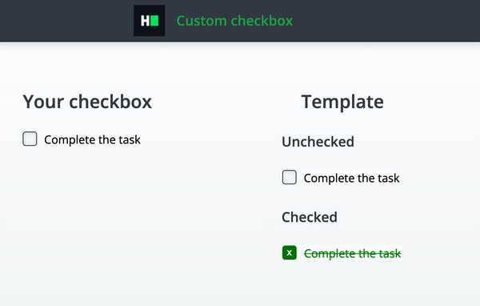

# CSS: Custom Checkbox
Complete a partially completed application. Complete the application shown below in order to pass all the unit tests.

## Environment 

- Node Version: ^14
- Default Port: 8000

## Application Demo:


## Application description

Your layout contains following elements:
* Checkbox
* Label

Complete a custom checkbox layout with the following UI:
* Checkbox height and width should be 20px
* Checkbox should have a border of 1px and grey (`#2f2f2f`) color
* Checkbox should have a border radius 4px
* Checkbox should have a distance to its label of 10px
* Checkbox should have a custom "checked" icon:
  * Checked box should be filled with a green color (`#008002`) 
  * Checked box should have a border of a green color (`#008002`) 
  * Checked box should contain a symbol "x" inside
  * Symbol "x" should be of a white color
  * Symbol "x" should be positioned in the middle of the box
* When the checkbox is checked, the label should become green (`#008002`)
* When the checkbox is checked, the label should become crossed


All the markup for the question has been added. As a candidate, you have to complete the CSS file to implement the above-stated features.

## Project Specifications

**Read Only Files**
- `test/*`
- `src/index.js`
- `src/index.html`
- `src/css/readonly.css`
- `app.js`

**Commands**
- run: 
```bash
npm start
```
- install: 
```bash
npm install
```
- test: 
```bash
npm test
```
